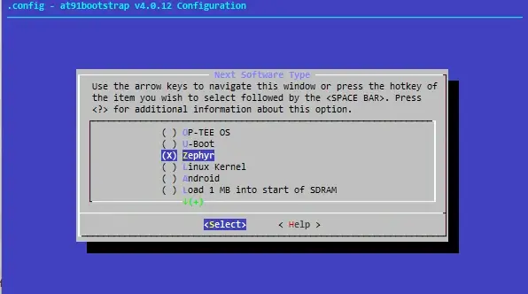
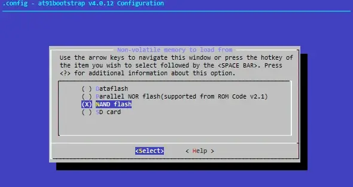
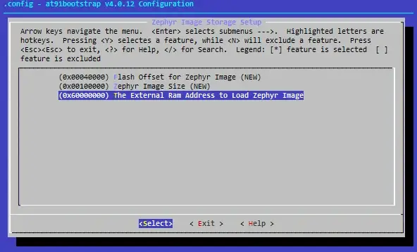
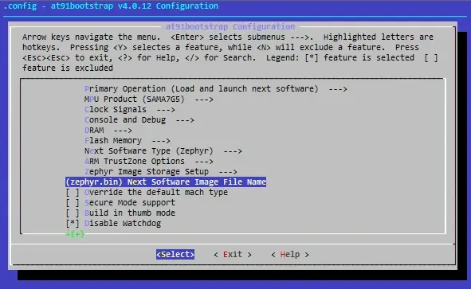

# Running Zephyr on a Microchip MPU

## Overview

This guide explains how to run **Zephyr** on a Microchip MPU.

For most Microchip MPUs, the Zephyr image size typically exceeds **128 KB**, which is the size of
the internal SRAM on many devices. Because of this limitation, Zephyr is usually executed from
**DDRAM** instead of internal SRAM.

To support this boot flow, a bootloader is required. In this guide, **AT91Bootstrap** is used as the
bootloader.

AT91Bootstrap performs the following tasks:

- Initializes the required hardware, especially DDRAM
- Loads the Zephyr image from external non-volatile memory into DDRAM
- Jumps to the DDRAM execution address
- Transfers control to Zephyr

## AT91Bootstrap

### 1. What Is AT91Bootstrap?

**AT91Bootstrap** is a second-stage bootloader developed and maintained by Microchip for its
Arm-based 32-bit microprocessors, including the **SAM9X**, **SAMA5**, and **SAMA7G5** families.

Its primary role is to initialize hardware such as clocks, PIO, and DRAM, configure peripherals, and
load the main application into memory. The main application can be:

- U-Boot
- Linux
- Zephyr or another RTOS
- A bare-metal application
- A debugger or custom binary

AT91Bootstrap can load software from various boot media, including:

- NAND Flash
- QSPI NOR Flash
- SD Card
- eMMC
- DataFlash

After loading the application into main memory, AT91Bootstrap starts its execution.

AT91Bootstrap is highly configurable, lightweight, and optimized for fast execution, making it
suitable for time-sensitive embedded applications. It uses a **Kconfig-based build system**, similar
to the Linux kernel and U-Boot, allowing developers to customize the bootloader for their hardware
and boot requirements.

For more information, see:

[AT91Bootstrap: A Second Stage Bootloader for Microchip MPUs](https://developerhelp.microchip.com/xwiki/bin/view/products/mcu-mpu/32bit-mpu/at91bootstrap/)

### 2. Boot Strategies

The MPU boot process starts with the internal ROM code. The ROM code checks the **Boot Mode Select
(BMS)** pin and scans the available boot media for a valid application.

If a valid application is found, the ROM code loads it into internal SRAM and executes it. If no
valid application is found, the **SAM-BA Monitor** is launched, allowing programming through USB or
a serial port.

AT91Bootstrap can be configured to load different types of next-stage software,
such as:

- U-Boot
- Linux kernel
- Zephyr or another RTOS
- A debugger
- A bare-metal application

It can also be customized for different boot sources and hardware configurations.

For detailed boot strategy information, refer to the datasheet of the target MPU device.

### 3. Building and Configuring AT91Bootstrap


#### Source Code

Download the AT91Bootstrap source code from [GitHub](https://github.com/linux4sam/at91bootstrap):

```bash
git clone https://github.com/linux4sam/at91bootstrap.git
```

#### Cross-Compiler

Use an ARM GNU toolchain, such as:
- gcc-arm-linux-gnueabi
- arm-none-linux-gnueabihf

#### Configuration

Default configuration files, also known as `defconfig` files, are provided for many evaluation kits.
There files are located in the `configs` directory.

For example, to configure SD boot for Zephyr on the SAMA7G5-EK board, run:

```bash
$ make mrproper
$ make sama7g5eksd_zephyr_defconfig
```

#### Customization

Use the following command to customize AT91Bootstrap configurations:
```bash
make menuconfig
```

Common configurations that can be customized include:
- Boot source
- Clock configuration
- DRAM timing confiruations
- Console/debug options
- Board-specific quirks or workarounds

After making changes, save the configuration with:

```bash
make savedefconfig
```

#### Build

Compile AT91Bootstrap by running:

```bash
make
```

The generated binary ,such as `boot.bin`, will be in the `binaries` directory.

### 4. Flashing AT91Bootstrap

Use the [**SAM-BA**](https://www.microchip.com/en-us/products/microprocessors/32-bit-mpus/sam-ba-in-system-programming-provisioning)
tool to flash `boot.bin` to the target non-volatile memory, such as NAND Flash, QSPI Flash, or eMMC.

For SD card boot, the SD card should use a **DOS/MBR partition table** with a **FAT-formatted boot
partition**, typically **FAT32**. Copy `boot.bin` to the root directory of the SD card.

For NAND Flash boot, ensure that the **PMECC header** is correctly prepended to the binary (handled
by scripts or by **SAM-BA**).

## AT91Bootstrap for Zephyr

### Default configuration files

The following default configuration files are provided for booting Zephyr from an SD card:
- sama7d65_curiositysd1_zephyr_defconfig
- sama7g5eksd_zephyr_defconfig

### Key configuration items

Here lists the most important configuration items for booting Zephyr from AT91Bootstrap.

***Next Software Type***

Select **Zephyr** as the next software type when booting Zephyr with AT91Bootstrap.


***NVM to load from***

AT91Bootstrap can boot Zephyr from several types of non-volatile memory, including:
- SPI Dataflash
- parallel NOR flash
- NAND flash
- SD card



***Zephyr Image Storage Setup***

This configuration menu allows you to set the offset, size, and external RAM address for the Zephyr
image.

AT91Bootstrap loads the Zephyr image from the specified offset in non-volatile memory, using the
configured image size, and copies it to the configured DDRAM address. It then jumps to that DDRAM
address and transfers control to Zephyr.

For booting from SD, only needs to config the External RAM Address.



***Zephyr Image File Name***

This option is used only when booting from an SD card.

The configured file name must match the Zephyr image file copied to the SD card.



### Example: booting Zephyr hello_world from SD card (SAMA7G54-EK)

Following is the log of booting Zephyr **hello_world** from SD card on SAMA7G54-EK board:
```
AT91Bootstrap 4.0.12-00006-ga1c9b2f8 (2026-03-30 12:30:00)

SD/MMC: Image: Read file zephyr.bin to 0x60000000
MMC: ADMA supported
SDHC: Timeout waiting for command 1 complete
SD: Card Capacity: High or Extended
SD: Specification Version 3.0X
SD/MMC: Done to load image
*** Booting Zephyr OS build v4.3.0 ***
Hello World! sama7g54_ek/sama7g54
```
